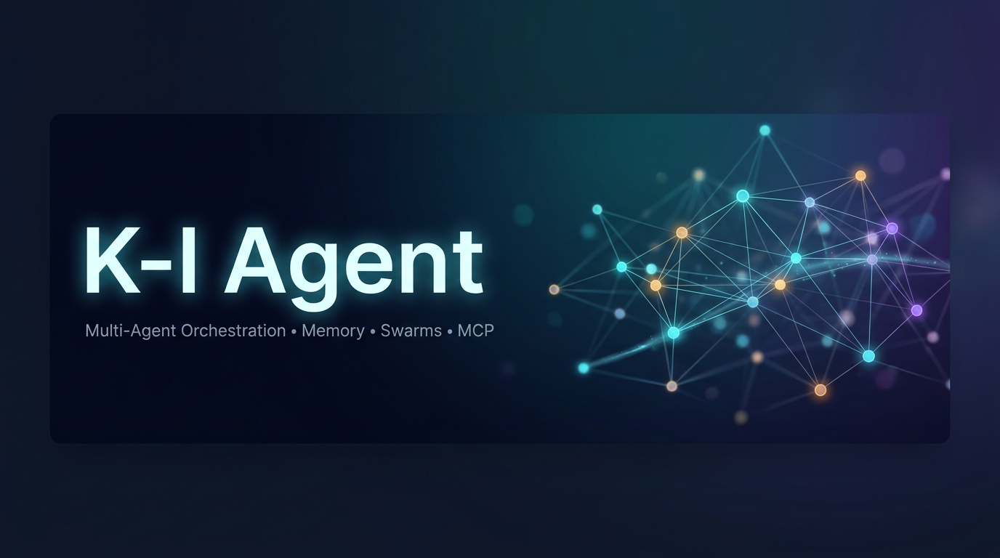

<div align="center" dir="rtl">



[]()
[](LICENSE)
[](https://nodejs.org)
[](https://www.typescriptlang.org)

# K-I Agent (کی‌آیِ اِجنت)

**«قاب‌محور» (Meta-Harness) هوشمند برای Claude Code و Codex**

چندعاملی (Multi-Agent) — حافظه‌ی خودایامز — کوادشون با سوارم‌ها — و یکپارچه‌سازی MCP

📖 **نسخه‌ی انگلیسی:** [English README](README.md)

</div>

---

## 🚀 K-I Agent چیست؟ (در سه خط)

بیشتر ما با هوش مصنوعی از طریق یک پنجره‌ی چت آشنا شده‌ایم: سؤال می‌پرسیم، جواب می‌گیریم. ولی کارهای واقعی — توسعه‌ی یک محصول، بازرسی امنیتی، تحقیق و مستندسازی — با **یک** جواب تمام نمی‌شوند. آن‌ها به چند مرحله نیاز دارند: طرح، اجرا، تست، بازبینی و ثبت تصمیم‌ها.

**K-I Agent** لایه‌ی اجرایی دور مدل‌های هوش مصنوعی است. مدل (مثلاً Claude) «متفکر» است؛ K-I Agent «کارگاه» است: ابزار، حافظه، چرخه‌ی کار، محیط امن و کنترل‌های لازم را در اختیار مدل می‌گذارد — و علاوه بر آن، ده‌ها عامل (Agent) تخصصی را مثل یک تیم هماهنگ مدیریت می‌کند.

> **فرمول ساده:** `عامل = مدل + قاب` — مدل می‌نویسد؛ قاب به آن ابزار، حافظه، حلقه‌ی بازخورد و کنترل می‌دهد تا واقعاً کار کند.

```
 معماری خودایامز و خودبهینه‌شونده

کاربر --> K-I Agent (CLI/MCP) --> مسیریاب --> سوارم --> عوامل --> حافظه --> ارائه‌دهنده‌های LLM
                      ^                              |
                      +---- حلقه‌ی یادگیری <---------+
```

## ⭐ امکانات اصلی

| قابلیت | توضیح |
|--------|-------|
| 🤖 **۱۰۰+ عامل تخصصی** | عوامل آماده برای کدنویسی، تست، امنیت، مستندات، معماری و ... |
| 🐝 **هماهنگی سوارم** | الگوهای سلسله‌مراتبی، مش (mesh) و تطبیقی با اجماع (Raft، Gossip و ...) |
| 🧠 **خودایامز** | الگوهای عصبی SONA، ReasoningBank و یادگیری از مسیر کارهای موفق |
| 💾 **حافظه‌ی برداری** | پایگاه داده‌ی AgentDB با ایندکس HNSW — بازیابی معنایی (نه فقط کلمه‌ای) در کمتر از یک میلی‌ثانیه |
| ⚡ **کارکنان پس‌زمینه** | ۱۲ ویورکرت خودکار (بازرسی، بهینه‌سازی، پیدا کردن شکاف‌های تست و ...) |
| 🧩 **۳۵ پلاگین بومی** | پلاگین‌های Claude Code برای هر نیاز — از امنیت تا اتوماسیون مرورگر |
| 🔌 **چندارائه‌دهنده** | Claude، GPT، Gemini، Cohere و Ollama با مسیریابی هوشمند |
| 🛡️ **امنیت** | AIDefence (ضد تزریق پرامپت و شناسایی PII)، اعتبارسنجی ورودی، جلوگیری از traversing مسیر و تزریق دستور |
| 🌐 **فدراسیون عامل‌ها** | همکاری امن عامل‌ها روی **ماشین‌های مختلف** با اعتماد صفر (zero-trust) |
| 🔬 **MetaHarness** | نمره‌دهی به پیکربندی هوش مصنوعی پروژه‌ات و پیداکردن ریسک‌های امنیتی تنظیمات |
| 🌍 **رابط وب خودمیزبان** | چت چندمدل با فراخوانی موازی ابزارهای MCP — سورس آن در همین مخزن (`ruflo/src/ruvocal/`) |
| 🎯 **برنامه‌ریز GOAP** | تبدیل اهداف به زبان ساده به برنامه‌های قابل‌اجرا برای عامل‌ها (`v3/goal_ui/`) |

## 📚 یادگیری — از کجا شروع کنم؟

این مستندات به‌طور عمدی یک مسیر آموزشی دارد:

1. **این فایل** — اگر می‌خواهید بدانید پروژه چیست و چطور نصب می‌شود
2. **[شروع سریع فارسی](docs/fa/quickstart.md)** — نصب و اولین پروژه، قدم‌به‌قدم
3. **[K-I Agent به زبان ساده](docs/fa/k-i-agent-explained.md)** — ⭐ **مهم‌ترین بخش آموزشی**: ۱۴ فصل از ایده‌ی پایه تا کارهای عملی، هزینه و تأیید نتایج
4. **[راهنمای کاربر فارسی](docs/fa/userguide.md)** — مرجع روزمره: دستورات، حافظه، سوارم، MCP و پیکربندی
5. **[راهنمای کاربر انگلیسی](docs/USERGUIDE.md)** — مرجع کامل و جزئی

> 💡 **توصیه‌ی آموزشی:** لازم نیست همه‌ی ابزارها را یاد بگیرید. با یک وظیفه‌ی کوچک شروع کنید (مثلاً «نقشه‌ی پروژه‌ام را بساز و یک بازبینی امنیتی انجام بده») و فقط وقتی به مشکل خوردی، توان بعدی را اضافه کن.

## 🛠️ نصب و شروع سریع

### پیش‌نیازها

- **Node.js نسخه 20 یا بالاتر** — `node -v` برای بررسی
- **npm 9 یا بالاتر**
- یک دستیار کد مانند **Claude Code** یا **Codex** (اختیاری ولی توصیه‌شده)

### روش اول — نصب کامل از همین مخزن (توصیه‌شده)

```bash
# ۱) کپی کردن مخزن
git clone https://github.com/kiarash707/agents.git k-i-agent
cd k-i-agent

# ۲) نصب وابستگی‌ها و فعال‌سازی خط فرمان
npm install
npm link            # دستوری با نام k-i-agent را در دسترس می‌گذارد

# ۳) راه‌اندازی در پروژه‌ی خود
k-i-agent init      # دستیار راه‌اندازی تعاملی
k-i-agent doctor    # بررسی سلامت — Node، MCP، پایگاه حافظه، کلیدهای API
```

> ⚠️ **مهم:** `init` فایل‌های پیکربندی پروژه را می‌نویسد. ابتدا روی یک پروژه‌ی آزمایشی امتحان کنید، تغییرات را بررسی کنید، سپس روی پروژه‌ی اصلی اجرا کنید.

### روش دوم — پلاگین Claude Code (سبک)

اگر فقط دستورهای Slash می‌خواهید و نمی‌خواهید پروژه‌ات پر فایل شود:

داخل Claude Code:

```
/plugin marketplace add kiarash707/agents
/plugin install ruflo-core@k-i-agent
```

| | پلاگین (سبک) | نصب کامل (CLI) |
|---|---|---|
| چه چیزی می‌دهد | دستورهای Slash + چند مهارت + تعریف عامل‌ها | کل چرخه: عوامل، ۶۰+ دستور، MCP، هوک‌ها، دمون |
| فایل در پروژه‌ی شما | **صفر** | `.claude/`، پیکربندی، CLAUDE.md و ... |
| مناسب برای | آزمون سریع یک پلاگین | استفاده‌ی جدی و روزمره |

### اتصال دستی سرور MCP

```bash
# برای Claude Code
claude mcp add k-i-agent -- npx --yes k-i-agent mcp start
claude mcp list

# برای Codex CLI
codex mcp add k-i-agent -- npx --yes k-i-agent mcp start
codex mcp list
```

## 🧩 پلاگین‌ها — چه کاری انجام می‌دهند؟

همین مخزن ۳۵ پلاگین دارد. مهم‌ترین‌ها:

| دسته | پلاگین‌ها | کاربرد |
|------|-----------|--------|
| **هسته و هماهنگی** | `ruflo-core` · `ruflo-swarm` · `ruflo-autopilot` · `ruflo-loop-workers` · `ruflo-workflows` · `ruflo-federation` | پایه‌ی سیستم، تیم‌های عامل، اجرای خودکار، کارهای دوره‌ای، فرایندهای آماده، همکاری بین‌ماشینه‌ای |
| **حافظه و دانش** | `ruflo-agentdb` · `ruflo-rag-memory` · `ruflo-rvf` · `ruflo-ruvector` · `ruflo-knowledge-graph` | پایگاه حافظه، بازیابی هوشمند، بازگردانی حافظه‌ی جلسات، جست‌وجوی برداری، گراف دانش |
| **هوش و یادگیری** | `ruflo-intelligence` · `ruflo-graph-intelligence` · `ruflo-daa` · `ruflo-ruvllm` · `ruflo-goals` | یادگیری از موفقیت‌ها، استدلال گرافی، رفتار پویا، اجرای LLM محلی، شکستن اهداف بزرگ به برنامه |
| **کیفیت کد و تست** | `ruflo-testgen` · `ruflo-browser` · `ruflo-jujutsu` · `ruflo-docs` | تولید تست، اتوماسیون مرورگر، تحلیل ریسک diff، تولید مستندات |
| **امنیت** | `ruflo-security-audit` · `ruflo-aidefence` | اسکن آسیب‌پذیری و CVE، ضد تزریق پرامپت و شناسایی PII |
| **معماری و متدولوژی** | `ruflo-adr` · `ruflo-ddd` · `ruflo-sparc` · `ruflo-metaharness` · `ruflo-arena` | ثبت تصمیمات معماری، DDD، روش توسعه‌ی SPARC، نمره‌دهی به محیط عامل، مسابقات استراتژی |
| **DevOps و پایش** | `ruflo-migrations` · `ruflo-observability` · `ruflo-cost-tracker` | مهاجرت ایمن دیتابیس، لاگ/تریس/متریک، ردیابی هزینه‌ی توکن |
| **گسترش‌پذیری و حوزه‌های خاص** | `ruflo-agent` · `ruflo-plugin-creator` · `ruflo-iot-cognitum` · `ruflo-neural-trader` · `ruflo-market-data` | ساخت پلاگین خودتان، آی‌اوتی، تحلیل مالی و ... |

> 📌 نام فنی پلاگین‌ها (مثل `ruflo-core`) شناسه‌ی فنی داخلی آن‌هاست و در سورس و مانیفست‌ها به همین نام ثبت شده‌اند؛ به همین دلیل بدون تغییر باقی مانده‌اند تا سیستم پلاگین‌ها دقیقاً مثل قبل کار کند. فهرست کامل با توضیح هر پلاگین در [README انگلیسی](README.md) آمده است.

## 🤝 فدراسیون — «اسلک»ِ عامل‌ها

فدراسیون به عامل‌های **دو یا چندین ماشین** اجازه می‌دهد یکدیگر را پیدا کنند، هویتشان را ثابت کنند (mTLS + امضای ed25519) و کار را با هم انجام دهند — در حالی که:

- اطلاعات محرمانه (PII) **قبل از خروج** از ماشین شما حذف می‌شود
- هر پیام **امضا** دارد و قابل پایش است
- اعتماد یک پیر (peer) با رفتار او بالا/پایین می‌شود؛ رفتار بد = افت فوری اعتماد

```
عامل شما --> [ حذف اسرار ] --> [ امضای پیام ] --> [ کانال امن ]
عامل مقابل <-- [ مسدودسازی حملات ] <-- [ بررسی هویت ] <-----------+
```

**قانون طلایی:** هرگز رازی را داخل پیام فدراسیون نگذارید.

راهنمای کامل: [`docs/federation/`](docs/federation/)

## 🔐 امنیت

این پروژه از چندلایه‌ی دفاع در مرزهای سیستم استفاده می‌کند:

- **اعتبارسنجی ورودی** با اسکیمای Zod برای همه‌ی ورودی‌های API
- **پرس‌و‌جوی‌های پارامتری SQL** برای جلوگیری از تزریق
- **جلوگیری از traversing مسیر** با ماژول `PathValidator`
- **محافظت از تزریق دستور** با ماژول `SafeExecutor`
- **AIDefence** — مسدودسازی تزریق پرامپت و شناسایی PII

سیاست گزارش آسیب‌پذیری: [SECURITY.md](SECURITY.md)

## 📁 ساختار مخزن (نمای کلی)

```
agents/
├── bin/                  # نقطه‌ی ورودی خط فرمان (k-i-agent)
├── plugins/              # ۳۵ پلاگین بومی Claude Code
├── v3/                   # هسته‌ی اصلی (CLI، MCP، کد Rust/Assembly و ...)
├── ruflo/                # رابط وب، اسکریپت‌های نصب و ابزارهای جانبی
├── docs/                 # مستندات — انگلیسی و فارسی (docs/fa/)
├── scripts/              # اسکریپت‌های نصب و ابزار
├── tests/                # تست‌ها
└── assets/               # تصاویر برندینگ K-I Agent
```

## 💡 نکات عملی قبل از شروع

1. **از کوچک شروع کنید:** یک وظیفه‌ی محدود با یک یا دو عامل کافیست. سوارم بزرگ برای پروژه‌ی بزرگ.
2. **نتیجه را بسنجید، نه فقط سرعت را:** معیار درست «هزینه به ازای هر نتیجه‌ی پذیرفته‌شده» است — زمان، هزینه‌ی توکن، ریت‌رای و بازبینی انسانی.
3. **به اطمینان وصل‌شدن اکتفا نکنید:** ثبت‌شدن یک ابزار یا عامل یعنی «در دسترس بودن»، نه «اجرا شده بودن». خروجی واقعی را ببینید.
4. **مرز مجوزها را مشخص کنید:** به عامل بگویید دقیقاً چه کار کند، کجا بایستد و چه شواهدی ارائه دهد.
5. **پیکربندی‌ها را reviw کنید:** هر بار که `init` یا پلاگینی اجرا شد، فایل‌های تولیدشده را یک‌بار نگاه کنید.

## 📄 لایسنس و مبدأ پروژه

**K-I Agent** با لایسنس **[MIT](LICENSE)** منتشر می‌شود.

این پروژه روی مبنای پروژه‌ی متن‌باز **[ruflo](https://github.com/ruvnet/ruflo)** ساخته‌شده توسط **[ruvnet](https://github.com/ruvnet)** بازنشانی (rebrand) شده است. لایسنس MIT به‌صورت صریح الزام می‌کند که **نویسنده‌ی اصلی و ذکر کپی‌رایت در همه‌ی نسخه‌ها باقی بماند**؛ بنابراین فایل `LICENSE` بدون تغییر در مخزن نگه داشته شده است. بازنشانی نام، مستندات، برندینگ و افزودن محتوای آموزشی جدید با مجوز همین لایسنس انجام شده و کاملاً مشروع است — اما حذف ذکر لایسنس و کپی‌رایت اصل، نقض قانونی لایسنس MIT و موضوع تakedown (DMCA) می‌شود.

**خلاصه برای کاربر نهایی:**
- ✅ استفاده شخصی، تجاری، تغییر، fork و انتشار مجدد: آزاد
- ✅ حفظ فایل LICENSE: **الزامی**
- ❌ حذف ذکر کپی‌رایت و ادعای «ساخته‌شده از صفر توسط ...»: غیرمجاز

## 🔗 منابع

| منبع | لینک |
|------|------|
| راهنمای کاربر انگلیسی (مرجع کامل) | [docs/USERGUIDE.md](docs/USERGUIDE.md) |
| آموزش انگلیسی (۱۴ فصل) | [docs/k-i-agent-explained.md](docs/k-i-agent-explained.md) |
| وضعیت قابلیت‌ها | [docs/STATUS.md](docs/STATUS.md) |
| راهنمای MetaHarness | [docs/metaharness-user-guide.md](docs/metaharness-user-guide.md) |
| فدراسیون | [docs/federation/](docs/federation/) |
| گزارش باگ | [GitHub Issues](https://github.com/kiarash707/agents/issues) |
| مشارکت | [CONTRIBUTING.md](CONTRIBUTING.md) |

<div align="center" dir="rtl">

**ساخته‌شده با 🧠 برای تیم‌های توسعه‌دهنده**

*K-I Agent v3.45.0*

</div>
